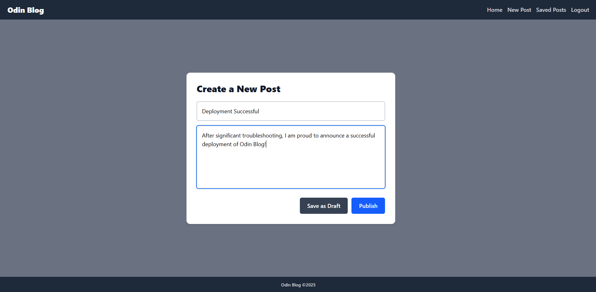

# Odin Blog - User Interface
The front end for the Odin Blog application, integrated with a custom REST API (see [odin-blog](https://github.com/ChristianKierna/odin-blog)). The project was implemented as a submission for the NodeJS course in the [Odin Project](https://www.theodinproject.com/).

The Odin Blog front end provides and interface where authenticated users can share and view blog posts, and interact with the posts via comments (GET, POST, UPDATE, DELETE functionality for all posts and comments).

**Deployment:** https://odin-blog-frontend-black.vercel.app/

## Built With

- [Node.js](https://nodejs.org/) – JavaScript runtime
- [React](https://react.com/) – JavaScript Library
- [Odin Blog API](https://github.com/ChristianKierna/odin-blog) – Custom RESTful API
- [Tailwind CSS](https://tailwindcss.com/) – CSS Framework

## Lessons Learned

The main goal of this project was to integrate a user interface with an existing backend API. A couple things that I want to improve
upon in future projects;

* Better documentation
* Implementating unit tests
* Experiment with more modular CSS / better adhere to best practices for styling React apps
