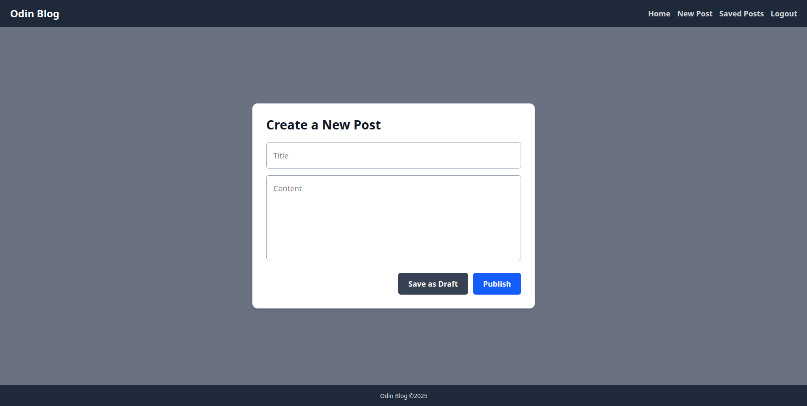

# Odin Blog - User Interface
The front-end for the Odin Blog application, integrated with a custom REST API. Implemented as a submission for the NodeJS course in the Odin Project (full-stack JavaScript track).

Odin Blog provides an interface where authenticated users can share and view blog posts, and interact with other user's posts. 

**Link to project:**

## Built With

- [Node.js](https://nodejs.org/) – JavaScript runtime
- [React](https://react.com/) – JavaScript Library
- [Odin Blog API](https://github.com/ChristianKierna/odin-blog) – Custom API
- [Tailwind CSS](https://tailwindcss.com/) – CSS Framework

## Lessons Learned

The main goal of this project was to integrate a user interface with an existing backend API. A couple things that I want to improve
upon in future projects;

* Better documentation
* Implementating unit tests
* Experiment with more modular CSS / better adhere to best practices for styling React apps
